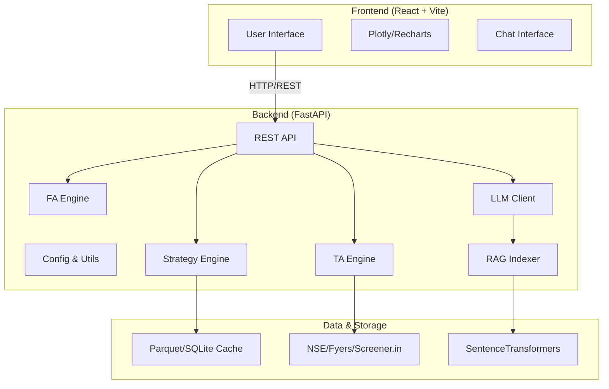

# Stock Strategy Analyzer Chatbot 

A comprehensive AI-powered stock trading ecosystem that combines algorithmic strategy ranking, technical & fundamental analysis, and a Retrieval-Augmented Generation (RAG) chatbot to empower traders with explainable, data-driven insights.


---

##  Core Features

### 1. Algorithmic Strategy Engine
- **VCP (Volatility Contraction Pattern)**: Proprietary algorithm detecting "tightening" price action and volume contraction.
- **Breakout Detection**: Multi-factor verification of price moves with institutional volume analysis.
- **Strategy Ranking**: Real-time ranking of stocks based on Breakout, Swing, and Intraday opportunities using daily OHLCV data.

### 2. Hybrid Analysis (TA + FA)
- **Technical Analysis (TA)**: custom signal scoring using RSI, MACD, Bollinger Bands, and Moving Averages.
- **Fundamental Analysis (FA)**: Automated financial health checks (ROE, P/E, Debt-to-Equity) with qualitative AI-driven risk/strength assessments.
- **Trade Planning**: Automated calculation of Entry, Stop-Loss (ATR-based), and Target levels for defined risk management.

### 3. AI-Powered Chatbot & RAG
- **Explainable AI (XAI)**: Chatbot specifically tuned to explain technical signals in natural language using structured bullet points and tables.
- **Local RAG Index**: Uses `SentenceTransformers` to convert strategy documentation and news into embeddings for context-aware responses without retraining.
- **Provider Agnostic**: Seamlessly switch between OpenAI (GPT-4o/o1) and Ollama (Llama 3.1/Mistral) for local or cloud inference.

---

##  Architecture



---

##  Tech Stack

- **Backend**: FastAPI, Pandas, NumPy, Pandas-TA (manual fallbacks), SentenceTransformers.
- **Frontend**: React (Vite), TailwindCSS, Plotly.js.
- **Infrastructure**: Docker, Docker Compose, SQLite, Parquet.
- **AI/ML**: OpenAI API, Ollama (Local), HuggingFace Embeddings.

---

## 🚀 Getting Started

### Prerequisites
- Python 3.9+
- Node.js 18+ & npm
- Docker (Optional)

### 1. Installation

```bash
# Clone the repository
git clone https://github.com/Anshul-ydv/Trading_Chatbot.git
cd Stock_Trade_strategy_analyser_Chatbot-main
```

### 2. One-Step Setup (Recommended)
You can use the provided setup script to initialize both backend and frontend:
```bash
cd trading-chatbot
bash setup.sh
```

### 3. Manual Configuration
1. **Backend**:
   ```bash
   cd trading-chatbot
   python -m venv .venv
   source .venv/bin/activate  # Windows: .venv\Scripts\activate
   pip install -r requirements.txt
   cp .env.example .env
   ```
2. **Frontend**:
   ```bash
   cd frontend
   npm install
   ```

### 4. Running the App

**Option A: Using Docker (Fastest)**
```bash
cd trading-chatbot
docker-compose up --build
```

**Option B: Separate Terminals**
- **Backend**: `python run.py` (from `trading-chatbot/`)
- **Frontend**: `npm run dev` (from `trading-chatbot/frontend/`)

---

##  Environment Settings

Key variables in `.env`:
- `LLM_PROVIDER`: `openai` or `ollama`
- `ALLOW_SYNTHETIC_DATA`: `1` (use generated data if live APIs fail)
- `ALLOW_SCREENER_HTTP`: `1` (enable live fundamental scraping)

---

##  License

This project is licensed under the MIT License - see the [LICENSE](LICENSE) file for details.

